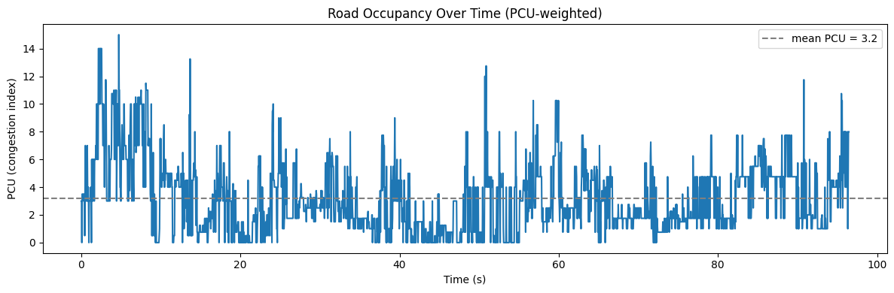
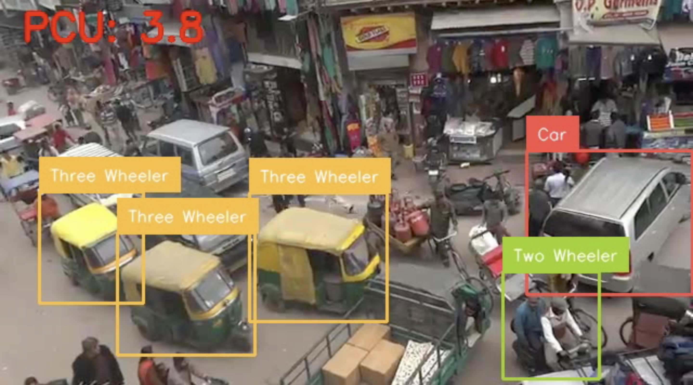

# YOLO26 Indian Traffic Detection + PCU Congestion Analyzer

Fine-tunes YOLO26 on Indian traffic imagery and turns raw detections into a **Passenger Car Unit (PCU) congestion index** — the metric Indian traffic engineers actually use (per IRC SP-41 / IRC:106-1990) to normalize mixed vehicle types into one comparable congestion number.

**Dataset:** [Indian Traffic Objects](https://universe.roboflow.com/amit-3ttxd/indian-traffic-objects) (Roboflow Universe) — 2.8k images, 9 classes: Bus, Car, Fixed Obstacle, Modified, Three Wheeler, Tractor, Truck, Two Wheeler, Vikram.

## Why fine-tune at all?

COCO-pretrained detectors under-detect autorickshaws, tempos/Vikrams, and Indian tractor-trailers, since none of these exist as COCO classes. A model trained only on Western traffic imagery simply doesn't have the vocabulary for mixed Indian traffic.

## Approach

* **Hyperparameter selection over blind defaults.** With only ~2.8k images, the wrong learning rate or augmentation strength can either overfit or destroy the pretrained COCO features. Three configs (near-default baseline, a frozen-backbone conservative fine-tune, and a heavier-augmentation run) were trained for a short, equal epoch budget and compared before committing to a full run. The three landed within 0.02 mAP50-95 of each other — baseline and conservative essentially tied (~0.645), aggressive augmentation trailed slightly (~0.625), likely because heavy mixup/rotation needs more than 12 epochs to pay off. The choice was data-driven, even if the margin was modest.
* **Checkpointed to Google Drive**, so a dropped Colab session doesn't cost lost training time.
* **Class imbalance acknowledged, not hidden.** Fixed Obstacle is the most represented class in the dataset (~2,600 instances) — more than double any other class — while Modified (~400) and Two Wheeler (~700) are the most underrepresented. That imbalance doesn't map cleanly onto accuracy, though: Fixed Obstacle still finishes near the bottom on mAP50-95 despite having the most data, because the label covers visually inconsistent things (barricades, potholes, debris, dividers). Two Wheeler's weak AP looks more like a small-object/occlusion problem than a data-volume one.

## Standout feature: PCU Congestion Analyzer

Raw bounding boxes are the easy part. This project converts detections into a domain-specific traffic engineering metric: PCU weighting treats a bus as ~3x the road-space "cost" of a car, a two-wheeler as ~0.5x, and so on, then plots the weighted occupancy over a video timeline to surface peak congestion moments — the same normalization real transportation studies use, not an ad-hoc vehicle count.

**Weights used**, with sourcing:
- Car = 1.0, Two Wheeler = 0.5, Bus/Truck = 3.0 — commonly-cited IRC SP-41 standard values.
- Three Wheeler ≈ 0.75, Vikram (tempo/LCV) ≈ 1.5, Tractor ≈ 4.0 — approximate values from PCU literature on Indian mixed-traffic conditions; these vary by study, road geometry, and traffic composition, so treat them as a transparent, reproducible baseline rather than a precise calibrated constant.
- Modified = 1.0 — treated as a car-equivalent, since it's an ambiguous class with no standard PCU value to draw on.
- Fixed Obstacle = 0.0 — excluded from the PCU sum entirely, since it isn't a vehicle.

**Honest limitation:** this is a heuristic occupancy proxy from single-frame detections, not a calibrated traffic-flow measurement (no speed, headway, or lane data) — a natural next step would be to calibrate these weights empirically against this dataset itself.

*Road occupancy (PCU-weighted) over a ~100s clip. Mean PCU ≈ 3.2, with spikes to 14–15 during dense congestion.*

*Live PCU overlay during inference on a busy market street.*

## Results

**mAP50: 0.890 · mAP50-95: 0.693**

| Class | mAP50 | mAP50-95 |
|---|---|---|
| Truck | 0.960 | 0.752 |
| Bus | 0.942 | 0.786 |
| Tractor | 0.928 | 0.726 |
| Three Wheeler | 0.921 | 0.736 |
| Fixed Obstacle | 0.876 | 0.648 |
| Vikram | 0.868 | 0.713 |
| Car | 0.869 | 0.672 |
| Modified | 0.828 | 0.606 |
| Two Wheeler | 0.815 | 0.593 |

The per-class results don't follow a simple "more training data = higher AP" pattern. Fixed Obstacle has the most training instances of any class (~2,600) but still lands near the bottom on mAP50-95, most likely because the label covers visually inconsistent things. Two Wheeler is the single weakest class despite not being the smallest, which points more toward small-object size and heavy occlusion in dense traffic than toward data volume. The confusion matrix backs this up — Two Wheeler and Vikram both show meaningful "background" misses (0.18–0.22), meaning the model outright misses them in some frames rather than confusing them with another vehicle class.

*Class distribution, hyperparameter comparison, data volume vs. accuracy, and precision/recall per class.*

## Stack

`ultralytics` (YOLO26) · `roboflow` · `supervision` · OpenCV
